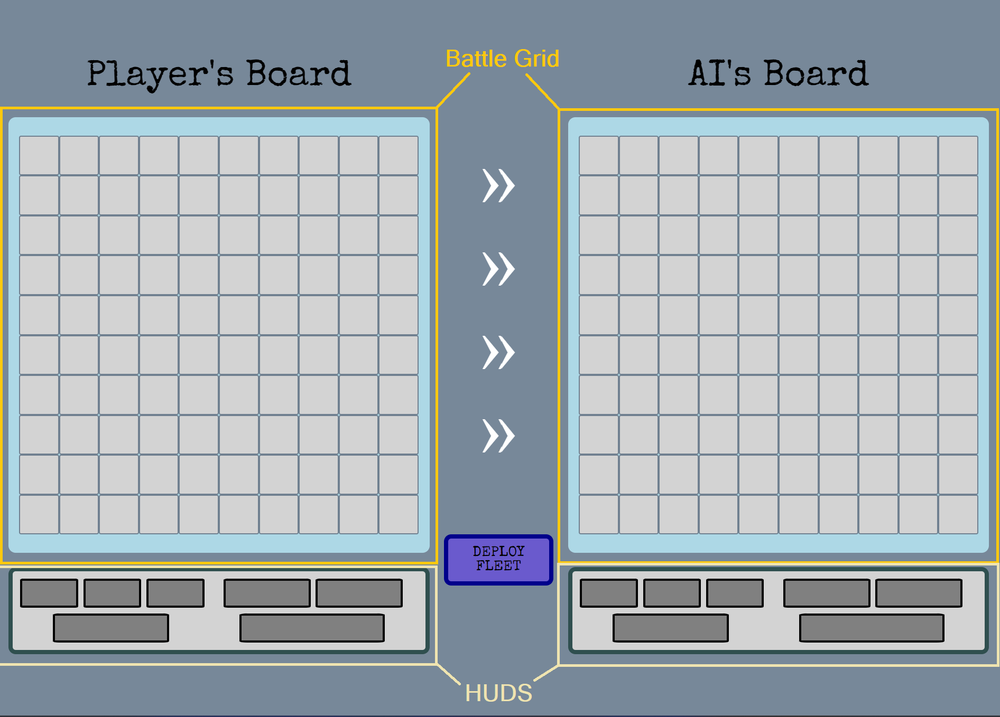

# Battleships

## To Battlestations!
In Battleships you have received the command of an artilery unit responsible for repeling the enemy's fleet.  Your own navy must de deployed to hold the enemy ships advancement while your artilery gets the job done.  Your fleet and yourself are the last line of defense against the imminent invasion! Defeat their ships before they sink your fleet!  

## Description & Motivation
This Battleship games is the first of four projects in the General Assembly SEI Course.  The purpose of this project was for us to apply our knowledge of the first part of the course. This game was a solo development over the course of one week.  The game was developed using the following technologies: 
    

### Try it out!
Since this is a free Web-based app, anyone can play it without any requirements. Just click this [link](https://casneno.github.io/Battleships-ProjectOne/) to play the game!  

## How to Play
The battle screen is divided into two parts: Your board and the Ai's board. Each player's board has a **Battle Grid** display, where the battle rages and a **HUD** at the bottom which keeps track of which ships were sunk.  



Brief
Instructions

Include the brief set by your instructional team here. This sets the context of the project you were working towards and mimics briefs you will be set later in your future roles.

This can either be in bullets or in a paragraph.


Insert your Brief here:

## About

### Planning

The game was first conceived within the Wireframe displayed below and it's display and functionalities were gradually improved as the development progressed.  The steps were organized acording to a Pseudocode (see below) and the development stages were checked and added/removed using Evernote.

| Main Screen |  |
| Battle Screen |  |

### Pseudocode

Below is the initial Pseudocode from the project planning:

* Render main screen
* Insert player name and click Play game button
* Render Battleship Screen
* Set:
 * Victory condition null
* Randomly place ships in Player grid
* Display turn message: Player 1
* Player clicks the opponent's grid
* Opponents Board:
 * Hit water, change grid sprit
 * Hit ship, change grid and check if ship is sunk:
  * Ship sunk? update the side bar
  *Ship not sunk? do nothing
* Are there any ships left in the opponent sidebar?
 * Yes: change turn
 * No: Display message player wins and stop game + Play again button
* Opponent's turn:
 * Ship sunk in previous turn? randomize click, else
 * Ship hit in previous turn? click in adjacent squares from last hit, else
 * Randomize click.
* Player's Board:
 * Hit water, change grid sprit
 * Hit ship, change grid and check if ship is sunk:
  * Ship sunk? update the side bar
  * Ship not sunk? do nothing
 * Are there any ships left in the player sidebar?
  * Yes: change turn
  * No: Display message opponent wins and stop game + Play again button
 * Reset Board State

*Creative Process and Brainstorming on Evernote*


### Building the Code

From the start I wanted the game to be scaleable, meaning that the grid size, number of ships and features could easily be change in future updates.  Also, by working with objects, my data manipulation would be as simplles as changing, adding or subtracting key-pair values for the desired effects.  For that matter I opted to work with 2D arrays and Objects.  
My first approach was to divide the code in two parts: 
1. The visual elements manipulation through the DOM, that responded to:
2. The data being held within the program inside of the objects.
  
The first step involved setting up a basic HTML and CSS, atributing Ids and classes to some elements and outlining the borders of my containers so I got a good visual of the layout I wanted. I opted to apply flex to most of my elements for a faster, more convenient and more responsive design.  The dynamically generated elements were left out for now.

Once I satisfied with the layout, I set-up the JavaScript file, generated the global variables that would change according to the state of the game, defined my only constant (the ship list with their properties), cached some elements with which I would later interact and added event listeners for some of these elements. Then I proceded to stubbing the functions according to what was planned in my pseudocode. I opted to separate my functions in 3 sections, according to their purpose (Modeling, Viewing or Controling), this way it would be more convenient to find them throughout the code.

Once stubbed, I first elaborated the modeling functions that dynamically generated the html elements for the grids and the HUD and applied them to the board. I went back to my CSS and adjusted the elements positions, gave them borders, color and removed the borders from the static elements giving the game a basic, yet functional appearence to be tested.  Next, I built the arrays that would store each player's board data and HUD data.  Finally I wrote the render function that would update the state of the game according to the information passed on by the data arrays.

*Generate my HTML elemnts dynamically*
```sh
function createBoardDisplay(board, rows, columns, hud) {
    for(let row = 0; row < rows; row++) {
        const elRow = document.createElement('div');
        elRow.className = 'row';
        for(let column = 0; column < columns; column++) {
            const elColumn = document.createElement('div');
            elColumn.className = 'cell';
            if(board === playerBoard) {
                elColumn.setAttribute('id', `p${row}${column}`)
            } else {
                elColumn.setAttribute('id', `a${row}${column}`)
            }
            elRow.appendChild(elColumn);
        }
        board.appendChild(elRow);
    }
    for (let i=0; i < SHIPLIST.length; i++) {
        const ship = document.createElement('div');
        if (hud === playerHud) {
            ship.setAttribute('id', `p${SHIPLIST[i].name}`);
            ship.className = SHIPLIST[i].class;
            ship.className = 'shipIcon';
        } else {
            ship.setAttribute('id', `a${SHIPLIST[i].name}`);
            ship.className = SHIPLIST[i].class;
            ship.className = 'shipIcon';
        }
        ship.className = SHIPLIST[i].class;
        hud.appendChild(ship);
    }
}
```
Once my display and data storage mechanisms were in place I began developing the control functions, which are responsible for manipulating the data within the arrays.  Such functions include the handlePlayer and handleAi, which takes an event (human) or logic input (computer) and manipulates the data in the board and HUD arrays. Once the data was manipulated, the functions would check for a winning condition, change turns and call the render function, updating the visual display and changing turns.  If winning conditions were met, the game deters any further action from being taken, display a win message and allow the user to play again, wiping the entire data and generating a new one.

*Check if ships can be placed*
```sh
function checkPlacement(board, rowIdx, colIdx, ship, direction) {
    let length = ship.size
    if (direction === 0) {
        if (colIdx+length > columns) return false;
        for (let i=0; i<length; i++) {
            if(board[rowIdx][colIdx+i].id !== 'w') return false;
        }
    } else {
        if (rowIdx+length > rows) return false;
        for (let i=0; i<length; i++) {
            if(board[rowIdx+i][colIdx].id !== 'w') return false;
        }
    }
    return true;
}
```

*Handle the Player's Move*
```sh
function handlePlayer(evt) {
    if (!startGame) return;
    if (turn === 1) {
        const tgt = evt.target;
        //Guards
        if (tgt.className !== 'cell') return;
        if (tgt.parentElement.parentElement.id !== 'aiboard') return; 
        const colIdx = parseInt(tgt.id.split('').pop()); 
        const rowIdx = parseInt(tgt.id.split('').slice(1,3)); 
        const cellObj = {...aiBoardData[rowIdx][colIdx], hit:true}; 
        aiBoardData[rowIdx][colIdx] = cellObj; 
        if (cellObj.id !== 'w') {  
            let shipHit = aiHudData.find((ship) => ship.name === cellObj.id);
            shipHit.size--;
            if (shipHit.size === 0) {
                aiBoardData.forEach(function (rowArr, rowIdx) {
                    rowArr.forEach(function (cellObj, colIdx) {
                        if (cellObj.id === shipHit.name) { 
                            cellObj = {...aiBoardData[rowIdx][colIdx], destroyed:true}; 
                            aiBoardData[rowIdx][colIdx] = cellObj;
                        }
                    })
                })
            }
            tgt.classList.add(shipHit.name);
        }
        winner = getWinner();
        turn *= -1;
        render();
    } return;
}
```

### Challenges

The game wasn't without it's challenges.  One first challenge I faced was how to get teh grid display properly comunicating with the 2D array so that it would be responsive to any changes I made to the objects. Next, came the array update codes: both HUD displays were being updated when the 'shots' were being taken.  At the time I wasn't so familiar with the spread operator and the array cloning process, so it took me some time to figure out that I needed to make a deep copy of my array, since they both originated from the same constant and thus had the same reference. The AI behaviour wasn't much of a challenge, but more of a process of mimicking the human thought process. 
Another challenging feature was the randomPlacement function and it's guards.  I had to make a check function to make sure that the space the ship was being placed was within the grid limits and did not overlap other ships.

### Wins

The game itself was a win for myself, having been the fist game I developed in any language (apart from the tic-tac-toe).  Having commited to the decision of working with objects was another win, since it took a lot of work and learning in the begining but now the flexibility it gave the game is finally paying off.  Finally, I would say that breaking the human thought process and implementing it into the AI's logic was also a win. 

### Key Learnings

 * DEBUGGING through DevTools and console.logs.
 * How to apply the PEAR method to explain issues to others in a way that they can help me.
 * How to better make use of DOM APIs such as selectors, event listeners, elemnt creation and appending, styling and attribute manipulations in JS.
 * How to make use MDN Web DOCs, W3Schools, GeeksforGeeks, StackOverflow and other online resources when I get stuck.
 * If I were to rebuild my code, I would do it using arrow functions instead of declarations for their practicality and shorthand.

### Bugs

* The MVP version has no Bugs in it and is fully functional.

### Future Improvements

Here is a list of future improvements:
 * Allow for amnual ship placement, click&drag and with hover effects;
 * Include sound and visual effects. inlcude some epic music;
 * Start the game with a start screen with some game context for immersion and a Insert Player name holder;
 * Develop an option for a 2-player game, taking turns on the same PC (can't peek!)
 * Improve the background by drawing the shoreline + include sprites for the ships, giving the game a more realistic feel.
 * Implement special weapons and maybe a mid-game suffling mechanism, allowing for ships to escape their doom
